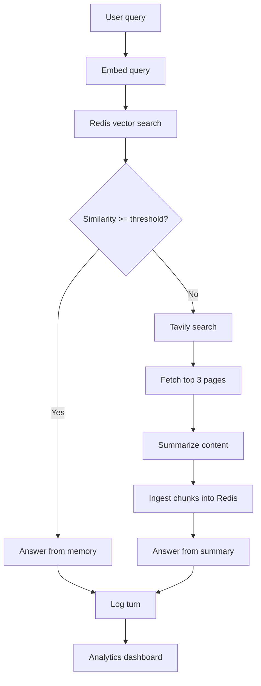

# Memory-First Web Agent

This repository contains a complete Python GenAI workflow for retrieval, memory, and analytics:

- Uses Azure OpenAI chat and embeddings for answering and retrieval.
- Uses LangGraph to orchestrate an end-to-end agent flow.
- Starts with memory-first routing: embeds the query and searches Redis vector memory.
- Applies a similarity gate with `MEMORY_SIMILARITY_THRESHOLD` (default `0.7`).
- On memory hit: answers only from retrieved memory context.
- On memory miss: runs Tavily web search, retrieves top 3 results, fetches page content, converts content to markdown, summarizes it, then answers.
- Ingests fetched web content into Redis as embedded chunks for future reuse.
- Returns grounded answers with source URLs in CLI output.
- Logs each turn to `logs/turns.jsonl` with route, similarity, topic, ingestion count, and sources.
- Generates analytics outputs (`logs/analytics_summary.json` and `logs/dashboard.html`) from turn logs.

## Architecture flow



## Setup

1. Install dependencies:

   ```bash
   pip install -r requirements.txt
   ```

2. Copy environment template and fill values:

   ```bash
   cp .env.example .env
   ```

Required variables:

- `AZURE_OPENAI_API_KEY`
- `AZURE_OPENAI_ENDPOINT`
- `AZURE_OPENAI_API_VERSION` (example: `2024-02-01`)
- `AZURE_OPENAI_DEPLOYMENT`
- `AZURE_OPENAI_EMBEDDING_DEPLOYMENT`
- `TAVILY_API_KEY`
- `REDIS_URL` (example: `redis://localhost:6379`)
- `REDIS_INDEX_NAME` (example: `memory_idx`)
- `MEMORY_SIMILARITY_THRESHOLD` (default: `0.7`)

## Redis requirement

Run Redis Stack (or Redis with RediSearch module enabled), because vector indexing requires RediSearch.

### Run Redis Stack with Docker

```bash
docker run -d --name redis-stack -p 6379:6379 -p 8001:8001 redis/redis-stack:latest
```

Optional checks and lifecycle commands:

```bash
# Check container is running
docker ps

# View Redis Stack logs
docker logs redis-stack

# Stop/start existing container
docker stop redis-stack
docker start redis-stack
```

## Run

```bash
python main.py "What are the latest developments in retrieval-augmented generation?"
```

The CLI prints:

- Answer
- Route (`memory_hit` or `memory_miss`)
- Top similarity score
- Source URLs

## Analytics dashboard

```bash
python main.py --analytics
```

Outputs:

- `logs/analytics_summary.json`
- `logs/dashboard.html`

## Output

- Turn log now includes: route, `memory_hit`, `top_similarity`, topic, and ingestion count.
