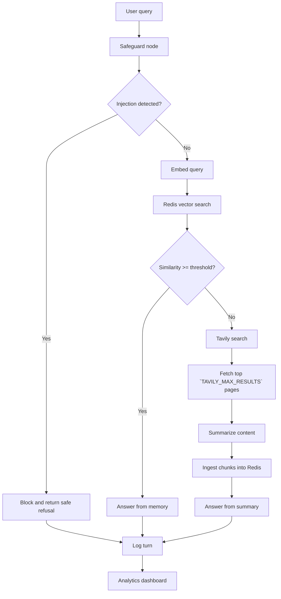

# Memory-First Web Agent

This repository contains a complete Python GenAI workflow for retrieval, memory, and analytics:

- Applies a top-level safeguard node that detects likely prompt-injection attempts.
- Uses Azure OpenAI chat and embeddings for answering and retrieval.
- Uses LangGraph to orchestrate an end-to-end agent flow.
- Starts with memory-first routing: embeds the query and searches Redis vector memory.
- Memory search is topic-aware for non-general topics and falls back to unfiltered search if topic-filtered retrieval returns no hits.
- Applies a similarity gate with `MEMORY_SIMILARITY_THRESHOLD` (default `0.7`).
- On memory hit: answers only from retrieved memory context.
- On memory miss: runs Tavily web search, retrieves up to `TAVILY_MAX_RESULTS` results, fetches page content, converts content to markdown, summarizes it, then answers.
- Ingests fetched web content into Redis as embedded chunks for future reuse.
- On injection detection: blocks execution before memory/web/tool calls and returns a safe refusal.
- Returns grounded answers with source URLs in CLI output.
- Logs each turn to `logs/turns.jsonl` with route, similarity, topic, ingestion count, and sources.
- Generates analytics outputs (`logs/analytics_summary.json` and `logs/dashboard.html`) from turn logs.

## Architecture flow



## Future improvements

- The fixed cosine similarity threshold (0.7) can be lowered or replaced with a lightweight LLM to determine whether the retrieved context is sufficient.
- The Redis search can be extended to hybrid retrieval by combining keyword and vector search.
- A reranking step can be added to improve the relevance of retrieved chunks before answer generation.
- A better topic classification using a lightweight LLM can be added.
- Retrieval and output safeguards using a lightweight LLM can be added to validate retrieved content and generated responses.
- An "I don't know" capability can be implemented when the available context is insufficient to answer confidently.
- Output validation using a lightweight LLM can be added to verify that responses are grounded in the retrieved context before they are returned.
- Conversation capabilities can be added with short-term memory.
- Similar question detection can be added to reuse previous answers. 
- A user interface can be added.

## Setup

1. Install dependencies:

   ```bash
   pip install -r requirements.txt
   ```

2. Copy environment template and fill values:

   ```bash
   cp .env.example .env
   ```

Required variables:

- `AZURE_OPENAI_API_KEY`
- `AZURE_OPENAI_ENDPOINT`
- `AZURE_OPENAI_API_VERSION` (example: `2024-02-01`)
- `AZURE_OPENAI_DEPLOYMENT`
- `AZURE_OPENAI_SAFEGUARD_DEPLOYMENT` (optional; if unset, safeguard uses `AZURE_OPENAI_DEPLOYMENT`)
- `AZURE_OPENAI_EMBEDDING_DEPLOYMENT`
- `TAVILY_API_KEY`
- `REDIS_URL` (example: `redis://localhost:6379`)
- `REDIS_INDEX_NAME` (example: `memory_idx`)
- `MEMORY_SIMILARITY_THRESHOLD` (default: `0.7`)
- `MEMORY_K` (default: `5`; the number of nearest neighbors Redis should return)
- `TAVILY_MAX_RESULTS` (default: `10`; the number of Tavily search results to request)
- `REQUEST_TIMEOUT_SECONDS` (default: `30`)
- `RETRY_MAX_ATTEMPTS` (default: `3`)
- `RETRY_INITIAL_BACKOFF_SECONDS` (default: `1`)
- `RETRY_MAX_BACKOFF_SECONDS` (default: `8`)

Network calls use bounded retries with exponential backoff. If retries are exhausted, the CLI exits with a clear execution error instead of hanging.

## Redis requirement

Run Redis Stack (or Redis with RediSearch module enabled), because vector indexing requires RediSearch.

### Run Redis Stack with Docker

```bash
docker run -d --name redis-stack -p 6379:6379 -p 8001:8001 redis/redis-stack:latest
```

Optional checks and lifecycle commands:

```bash
# Check container is running
docker ps

# View Redis Stack logs
docker logs redis-stack

# Stop/start existing container
docker stop redis-stack
docker start redis-stack
```

## Run

```bash
python main.py "What are the latest developments in retrieval-augmented generation?"
```

The CLI prints:

- Answer
- Route (`memory_hit`, `memory_miss`, or `blocked_prompt_injection`)
- Top similarity score
- Source URLs

## Safeguard behavior

- The safeguard runs before embedding, Redis search, Tavily search, and summarization.
- You can point safeguard classification to a separate deployment with `AZURE_OPENAI_SAFEGUARD_DEPLOYMENT`.
- If a query appears to be prompt-injection (for example, attempts to override system instructions), the agent stops early.
- Blocked turns are logged with route `blocked_prompt_injection`.

## Analytics dashboard

```bash
python main.py --analytics
```

Outputs:

- `logs/analytics_summary.json`
- `logs/dashboard.html`

## Output

- Turn log now includes: route, `memory_hit`, `top_similarity`, topic, and ingestion count.


